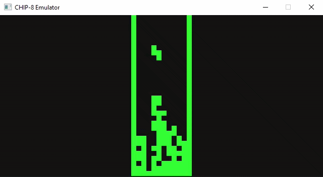

# CHIP-8 Emulator


[](https://github.com/Furkan5E/Chip8-Emulator/actions/workflows/build.yaml)

A cross platform CHIP-8 emulator written in C++17 using SDL2 for graphics, input, and audio.



[](https://github.com/Furkan5E/Chip8-Emulator/releases/latest)

## Features

* **Cycle Accurate CPU:** Faithfully decodes and executes the original CHIP-8 instruction set.
* **Hardware Audio:** Generates an authentic retro square wave tone via SDL2 audio callbacks.
* **Quality of Life Controls:** Built in support for pausing and instantly rebooting ROMs.

## Controls

**Standard Keypad**
| Original | Mapped To |
| :--- | :--- |
| `1 2 3 C` | `1 2 3 4` |
| `4 5 6 D` | `Q W E R` |
| `7 8 9 E` | `A S D F` |
| `A 0 B F` | `Z X C V` |

**System Controls**
* **Pause/Resume:** `P`
* **Reset ROM:** `ESC`

## Build Instructions

This project uses CMake's `FetchContent` to automatically download and link SDL2. No manual dependency management or DLL configuration is required.

```bash
git clone https://github.com/Furkan5E/Chip8-Emulator.git
cd Chip8-Emulator
cmake -B build -DCMAKE_BUILD_TYPE=Release
cmake --build build --config Release
```
Launch the executable via command line and pass the path to target ROM. You can optionally configure the window scale and CPU speed.
```bash
./build/Release/chip8 roms/TETRIS --scale 15 --speed 20
```
